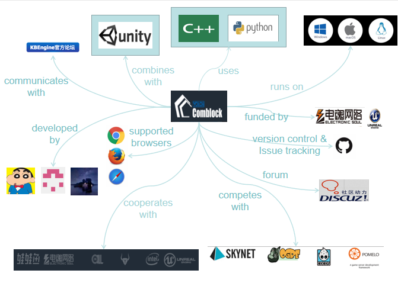

# KBEngine- An Open Source MMOG Server    Engine

## Abstract

An open source MMOG server engine. 

Just use Python scripting to be able to complete any game logic simply and efficiently (supports hotfixing).

Various KBEngine plugins can be quickly combined with (Unity3D, OGRE, Cocos2d-x, HTML5, etc.) technology to form a complete game client.

The engine is written in C++, and saves developers from having to re-implement common server-side technology, allowing them to concentrate on game logic development, to quickly create a variety of games.

## Table of Contents

* Introduction
* Stakeholders
* Context View
* Development View
* Functional View
* ...

## Introduction

In recent years, the game industry has become more and more popular, and even LOL has become the official game of the Asian Games. With the development of the game, more and more advanced game engines are needed. KBEngine is one of them. KBEngine is an open source MMOG game server engine. The server's underlying framework is written in C++. The game logic layer uses Python (supports hot updates). Developers do not need to repeatedly implement some of the underlying technologies commonly used by game servers to concentrate their energy to the game development level and quickly build a variety of online games. 

The KBEngine underlying architecture is designed as a multi-process distributed dynamic load balancing solution. In theory, it is only necessary to continuously expand the hardware to continuously increase the bearer limit. The upper limit of the single machine depends on the complexity of the game logic itself. 

KBEngine is the first commercial-grade server engine in China. It adheres to the concept of “powerful and simple” and has many features such as simultaneous online, automatic backup, cross-platform, simple configuration, dynamic load balancing, and open source code. At the same time, the KBEngine engine can quickly integrate with Unity3D, OGRE, Cocos2d-x, HTML5, and more, which means that game developers using other game engines can get started quickly with KBEngine.

## Stakeholders  

Stakeholders are the people that have interest in this Kbengine project and this organization. A stakeholder is a member of the "groups without whose support the organization would cease to exist". Stakeholders can obviously have their effect on the project's policy as well as the objective. In this section, we will firstly provide an overview of the different stakeholders identified by the project such as developers, maintainers, assessors users and so on. Hereafter, we will discuss how the issues and integrations are handled. <a href="#fig1">Figure 1</a> will show the summary of identified stakeholders of Kbengine based on the classification proposed by Nick Rozanski and Eoin Woods<a href="#1">[1]</a>.  

### Overview  

**Acquirers:**&nbsp;[YOLO Technology](https://www.comblockengine.com/aboutUs.html) is managing and growing the company and its assets.  

**Suppliers:**&nbsp;The development of Kbengine is coordinated via [Github](https://github.com), which can be safely classified as a supplier. Also, as Python is the scripting language for the engine, [Python](https://www.python.org/) is also regarded as a supplier.

**Developers:**&nbsp;Kbengine is supported by an open source [community](https://github.com/kbengine/kbengine/graphs/contributors) and by YOLO's engineers. In total, there are 25 Git contributors, among whom the top three recent contributors are:  

1. @[kbengine](https://github.com/kbengine/kbengine/commits?author=kbengine) 3,707 commits 
2. @[kebiao](https://github.com/kbengine/kbengine/commits?author=kebiao)  367 commits
3. @[basesrv](https://github.com/kbengine/kbengine/commits?author=basesrv) 89 commits. 

Developers deploy the Kbengine software and try to polish it.  

**Communicators:**&nbsp;There is a large [community](https://bbs.comblockengine.com/) for this highly-regarded open source project. More than four thousand active communicators are now in the community, continuing explaining the system to other stakeholders via documentation and other materials like demos.  

**System adminstrators:**&nbsp;Due to the features of the open source project, it is relatively difficult to draw a conclusion on who the adminstrator is, but there is no denying that [YOLO Technology](https://www.comblockengine.com/aboutUs.html) works as a regular adminstrator.

**Testers:**&nbsp;Testers test the project to ensure that it is suitable for game development. Users as well as developers all serve as the testers for this project.  

**Users:**&nbsp;This group include both big companies like [Electronic Soul](https://www.dianhun.cn/) and average users who are attempting developing their own games.  

**Competitors:**&nbsp;Undoubtedly, competitors are interested in the development of Kbengine since they are willing to provide a competing service. [Unreal](https://www.unrealengine.com/zh-CN/what-is-unreal-engine-4) and [Unity3D](https://unity3d.com/cn) are two big names with the most users worldwide. The former one is widely viewed as one of the most powerful engine for  and the latter one is suitable for beginners around the world. Nevertheless, when it comes to the game server engine or framework, [POMELO](http://pomelo.netease.com/) and [SKYNET](https://github.com/korialuo/skynet) are two that win most reputation.

<a name="fig1">

</a>

### Power-Interest Grid  

The power-interest grid contains the main stakeholder categories, as shown in <a href="#fig2">Figure 2</a>. There is no doubt that the core developer team takes the leading position in the figure. Suppliers like Github are also significant because the open source project highly depends on these third-party dependencies. Whereas, they apparently have little interest in this project. On the contrary, it is the users that have the highest interest while possess the lowest power.   

<a name="fig2">

</a>

## Context View

A context view describes the relationships, dependencies, and the interactions between the system and its environment. This view is relevant for the system's architecture and defines the boundaries of the system and how it interacts with external entities across these boundaries. <a href="#pics/Context View Picture.jpg">[Figure 3]()</a> shows the context view of KBEngine.

### System Scope

KBEngine is an open source game server engine. The client can communicate with the server through a simple protocol.  It saves developers from having to re-implement common server-side technology, allowing them to concentrate on game logic development, to quickly create a variety of games. It can be applied in:

* Game server
  * Chess
  * arpg
  * mmorpg
  * moba

* Non-game server
  * H5 check in server
  * H5 multiplayer app server
  * Communication relay server

* Any other aspects that need server communication

### Client

KBEngine is a server engine, but it can be combined with some client engines to form a complete game client. It is aimed at client development. By using its SDK, what the client developer needs to do is just receiving event data and completing the rendering. Now it supports several of the most popular client engines on the market, including:

* [Ogre](https://www.ogre3d.org/)
* [Unity3d](https://unity3d.com)
* [UnrealEngine](https://www.unrealengine.com)
* [Cocos2dx](http://www.cocos.com)
* HTML5-based engines or HTML5 pages

### Build-in Tools

KBEngine has many build-in tools to help developers to work easier. They are not dependencies in the sense that KBEngine cannot work without them, but can be thought of as additional features of  this project:

* `Installation Assistant`:  A simple Python scripting tool that can install, uninstall, update and review versions, etc.
* Excel Tool - `pyxlsx`:  It provides the artifacts for planning, you can output the excel file, which is produced in a certain format, into the .py file used by the server and the .json file used by the client.
* Interfaces:  Support third party functions.
* Logger:  Collect and backup runtime logs of different components. 

* Debug Tools
  * GUIConsole
  * WebConsole
  * PyCluster
  * bots: For pressure tests

### Other External Entities

* **Developing languages:**
  * The server's underlying framework is written in C++

  * The game logic layer uses Python(supports hotfixing)
* **Platforms:**  
  * PS4
  * X-BOX ONE
  * NINTENDO SWITCH
  * macOS 
  * Windows 
  * Linux 
  * HTML5 
  * iOS
  * Android
* **IDE for programming:**  Visual Studio for Windows
* **Communication tools:**  Github
* **Dependencies:**
  * MySQL
  * Python （When you wants to use the tools provided by the engine）
  * Office 2010 or above (When you wants to use the build-in tool `pyxlsx`)
* **Testing:**  Most of the tests can be run on the client servers, using C++ or python

## Development View

The development view describes the architecture of a project from the viewpoint of the developers. It is responsible for addressing different aspects of the system development process such as code structure and dependencies, build and configuration management of deliverables, system-wide design constraints, and system-wide standards to ensure technical integrity. Here, we will show the development view of KBEngine based on its Module Structure Model and Codeline Model.

### Module Structure Model

As we mentioned above, KBEngine is a server engine, but it can be combined with some client engines to form a complete game client. From a high-level view, the architecture is divided into three parts: rendering layer, plug-in layer and server. The rendering layer just means the client and it use the *fire/register* function to exchange messages/events with the plug-in layer. The plug-in layer will send the messages it gets from the rendering layer to the server, and the server will response to the client directly.

The high-level architecture is shown in <a href="#fig4">Figure 4</a>.

<a name="fig4">

</a>

For details, the codes of KBEngine can be divided into many parts based on their functions:

+ **Client:**  The KBEngine provides the framework , a lib file and API for clients to use.

+ **Loginapp:**  It is the first connection between the engine and the client, which is used for signing in and signing up.  When a client wants to sign in and use KBEngine, it will interact with the database to verify the identification of the client.
+ **Baseapp:**  It handles entities without space attribute, such as a *labor union* or *auction company*. There is also a special entity `Proxy` kept in Baseapp, which keeps the communication between the server and the clients. 
+ **Cellapp:**  It handles the logic of the game about space and location, such as *AOI*, *Navigate*, *AI* and so on. It also handles entities in the space (with space attribute), such as a room or a scene.
+ **BaseappMgr:**  It coordinates the work between all the Baseapps and keeps the load balance.
+ **CellappMgr:**  It coordinates the work between all the Cellapps and keeps the load balance.
+ **Database:**  The default choice is MySQL.
+ **DBMgr:**  It provides high-performance and multi-threaded data access and is responsible for managing different entities. It also keeps the communication between the database and entity. 

The module structure is shown in <a href="#fig5">Figure 5</a>.

<a name="fig5">

</a>

Furthermore, what is worth mentioning is that the KBEngine can have many processes of Loginapp, Baseapp and Cellapp but only one of BaseappMgr and CellappMgr. Take the Baseapp as an example, on one hand, each CPU can deal with only one Baseapp and each Baseapp can backup data for others so that a crash of one Baseapp won't affect the whole system. On the other hand，the BaseappMgr will coordinate the work between all the Baseapps and choose one process with little load to use in order to keep load balance. Therefore, by continuously expanding the hardware, the upper limit of the load can also be continuously increased. 

### Codeline Model

The overall structure of codeline is defined as how the code is controlled or designed, where different types of source code exist in that structure, and how it should be maintained and extended over time.

The following lines will show you how the source code is organized, tested and managed.

 

|- kbengine							(The root directory.)

​	|- assets						(The default game project asset library, you can add a new asset library through environment variable binding.)

​		|- res						(All resources.)

​			|- spaces				(Store resources related to the game scene.)

​			|- server				(Store the server-related configuration files.)

​		|- scripts				(Resources about the game logic.)

​			|- base				(Base’s Python logic.)

​			|- cell				(Cell’s Python logic.)

​			|- client			    (Client’s Python logic.)

​			|- bots				(Robot’s Python logic.)

​			|- common			(The common files about logic.)

​			|- data				(The data sources about logic.)

​			|- db				(Dbmgr’s extension script.)

​			|- entity_defs			(The definition of the entity.)

​                |-components    (The components of the entity.)

​				|- interfaces		(The definition of the entity’s interface.)

​			|- server_common		(The common logic of the server.)

​			|- user_type			(The directory of the user-defined types.)

​            |-login               (The login part.)

​	|- kbe						(The directory of the engine.)

​		|- tools					(The engine tools.)

​			|- server				(The tools of engine server.)

​				|- guiconsole			(Visual console tool.)

​				|- install			(The tools to install the engine.)

​				|- pycluster			(Cross-platform cluster Python controlling scripting tool.)

​			|- xlsx2py				(Game data table exporting tool.)

​		|- src						(KBEngine source code.)

​			|- build				(Makefile common scripts.)

​			|- client				(Client plugin and the directory of examples.)

​			|- lib					(Every mode’s source code.)

​				|- client_lib			(Client’s basic and public framework.)

​				|- db_mysql			(Mysql’s data.)

​				|- dependencies			(Dependency library.)

​				|- entitydef			(The definition of the entity.)

​				|- helper			(Some general and helpful modules.)

​				|- math				(Something about maths.)

​				|- navigation			(2D/3D navigation modules.)

​				|- network			(Network module.)

​				|- pyscript			(Script plugins.)

​				|- python			(Python source code.)

​				|- resmgr			(Resource manager.)

​				|- server			(Server’s public module.)

​				|- thread			(Multi-threaded module.)

​				|- xml			(Xml.)

​			|- libs					(*.lib, *.a files after compilation.)

​			|- server				(Server app source code.)

​				|- baseapp			(Baseapp source code.)

​				|- baseappmgr			(Baseappmgr source code.)

​				|- cellapp			(Cellapp source code.)

​				|- cellappmgr			(Cellappmgr source code.)

​				|- dbmgr			(Dbmgr source code.)

​				|- loginapp			(Loginapp source code.)

​				|- machine			(Machine source code.)

​				|- tools			(Server helping tool.)

​					|- interfaces		(Support third-party billing, third-party account and other interfaces.)

​					|- bots			(Stress test, virtual client and source code.)

​					|- guiconsole		(Visual console tool’s source code.)

​		|- res						(Engine resource directory.)

​			|- key					(RSA key.)

​			|- scripts				(Python Script library.)

​			|- server				(Server engine configuration.)

​				|- log4cxx_properties		(Log4cxx configuration.)

​	    |- bin						(Directory of executable files after compilation.)

​			|- server				(Directory of executable files on server after compilation.)

​	   

## Functional View

The functional view of a system defines the architectural elements that deliver the system’s functionality. This view shows the key functional elements, the external interfaces, and the internal structure of the system. In order to have a clear view of that, the project can be conceptually split into three layers, which can be seen in <a href="#fig5">Figure 5</a>.

### Loginapp

Functions|Description
---|:--:
`onClientActiveTick`, `onAccountActivated`| The client will get informed that the client is actvated.
`reqCreateAccount`, `onAccountBindedEmail`,`onReqAccountBindEmailAllocCallbackLoginapp`| Create an account and bind with the email.
`reqAccountResetPassword`| Reset the password.
`login`| Login.
`onLoginAccountQueryResultFromDbmgr`, `onLoginAccountQueryBaseappAddrFromBaseappmgr`, `onDbmgrInitCompleted`| Interact with database so that the request can be verified.
`onDbmgrInitCompleted`, `importClientMessages`| Complete the interaction and import the messages for later use.

