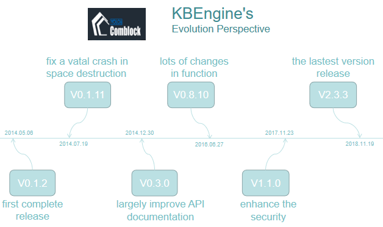

# KBEngine- An Open Source MMOG Server    Engine

## Abstract

An open source MMOG server engine. 

Just use Python scripting to be able to complete any game logic simply and efficiently (supports hotfixing).

Various KBEngine plugins can be quickly combined with (Unity3D, OGRE, Cocos2d-x, HTML5, etc.) technology to form a complete game client.

The engine is written in C++, and saves developers from having to re-implement common server-side technology, allowing them to concentrate on game logic development, to quickly create a variety of games.

## Table of Contents

* [Introduction](#introduction)
* [Stakeholders](#stakeholders)
* [Context View](#context-view)
* [Development View](#development-view)
* [Functional View](#functional-view)
* [Evolution Perspective](#evolution-perspective)
* [Technical Debt](#technical-debt)
* [Conclusion](#conclusion)
* [Reference](#reference)

## Introduction

In recent years, the game industry has become more and more popular, and even LOL has become the official game of the Asian Games. With the development of the game, more and more advanced game engines are needed. KBEngine is one of them. KBEngine is an open source MMOG game server engine. The server's underlying framework is written in C++. The game logic layer uses Python (supports hot updates). Developers do not need to repeatedly implement some of the underlying technologies commonly used by game servers to concentrate their energy to the game development level and quickly build a variety of online games. 

The KBEngine underlying architecture is designed as a multi-process distributed dynamic load balancing solution. In theory, it is only necessary to continuously expand the hardware to continuously increase the bearer limit. The upper limit of the single machine depends on the complexity of the game logic itself. 

KBEngine is the first commercial-grade server engine in China. It adheres to the concept of “powerful and simple” and has many features such as simultaneous online, automatic backup, cross-platform, simple configuration, dynamic load balancing, and open source code. At the same time, the KBEngine engine can quickly integrate with Unity3D, OGRE, Cocos2d-x, HTML5, and more, which means that game developers using other game engines can get started quickly with KBEngine.

## Stakeholders  

Stakeholders are the people that have interest in this Kbengine project and this organization. A stakeholder is a member of the "groups without whose support the organization would cease to exist". Stakeholders can obviously have their effect on the project's policy as well as the objective. In this section, we will firstly provide an overview of the different stakeholders identified by the project such as developers, maintainers, assessors users and so on. Hereafter, we will discuss how the issues and integrations are handled. <a href="#fig1">Figure 1</a> will show the summary of identified stakeholders of Kbengine based on the classification proposed by Nick Rozanski and Eoin Woods<a href="#1">[1]</a>.  

### Overview  

**Acquirers:**&nbsp;[YOLO Technology](https://www.comblockengine.com/aboutUs.html) is managing and growing the company and its assets.  

**Suppliers:**&nbsp;The development of Kbengine is coordinated via [Github](https://github.com), which can be safely classified as a supplier. Also, as Python is the scripting language for the engine, [Python](https://www.python.org/) is also regarded as a supplier.

**Developers:**&nbsp;Kbengine is supported by an open source [community](https://github.com/kbengine/kbengine/graphs/contributors) and by YOLO's engineers. In total, there are 25 Git contributors, among whom the top three recent contributors are:  

1. @[kbengine](https://github.com/kbengine/kbengine/commits?author=kbengine) 3,707 commits 
2. @[kebiao](https://github.com/kbengine/kbengine/commits?author=kebiao)  367 commits
3. @[basesrv](https://github.com/kbengine/kbengine/commits?author=basesrv) 89 commits. 

Developers deploy the Kbengine software and try to polish it.  

**Communicators:**&nbsp;There is a large [community](https://bbs.comblockengine.com/) for this highly-regarded open source project. More than four thousand active communicators are now in the community, continuing explaining the system to other stakeholders via documentation and other materials like demos.  

**System adminstrators:**&nbsp;Due to the features of the open source project, it is relatively difficult to draw a conclusion on who the adminstrator is, but there is no denying that [YOLO Technology](https://www.comblockengine.com/aboutUs.html) works as a regular adminstrator.

**Testers:**&nbsp;Testers test the project to ensure that it is suitable for game development. Users as well as developers all serve as the testers for this project.  

**Users:**&nbsp;This group include both big companies like [Electronic Soul](https://www.dianhun.cn/) and average users who are attempting developing their own games.  

**Competitors:**&nbsp;Undoubtedly, competitors are interested in the development of Kbengine since they are willing to provide a competing service. [Unreal](https://www.unrealengine.com/zh-CN/what-is-unreal-engine-4) and [Unity3D](https://unity3d.com/cn) are two big names with the most users worldwide. The former one is widely viewed as one of the most powerful engine for  and the latter one is suitable for beginners around the world. Nevertheless, when it comes to the game server engine or framework, [POMELO](http://pomelo.netease.com/) and [SKYNET](https://github.com/korialuo/skynet) are two that win most reputation.

<a name="fig1">

</a>

### Power-Interest Grid  

The power-interest grid contains the main stakeholder categories, as shown in <a href="#fig2">Figure 2</a>. There is no doubt that the core developer team takes the leading position in the figure. Suppliers like Github are also significant because the open source project highly depends on these third-party dependencies. Whereas, they apparently have little interest in this project. On the contrary, it is the users that have the highest interest while possess the lowest power.   

<a name="fig2">

</a>

## Context View

A context view describes the relationships, dependencies, and the interactions between the system and its environment. This view is relevant for the system's architecture and defines the boundaries of the system and how it interacts with external entities across these boundaries. [Figure 3](#fig3) shows the context view of KBEngine.

<a name="fig3">

</a>

### System Scope

KBEngine is an open source game server engine. The client can communicate with the server through a simple protocol.  It saves developers from having to re-implement common server-side technology, allowing them to concentrate on game logic development, to quickly create a variety of games. It can be applied in:

* Game server
  * Chess
  * arpg
  * mmorpg
  * moba

* Non-game server
  * H5 check in server
  * H5 multiplayer app server
  * Communication relay server

* Any other aspects that need server communication

### Client

KBEngine is a server engine, but it can be combined with some client engines to form a complete game client. It is aimed at client development. By using its SDK, what the client developer needs to do is just receiving event data and completing the rendering. Now it supports several of the most popular client engines on the market, including:

* [Ogre](https://www.ogre3d.org/)
* [Unity3d](https://unity3d.com)
* [UnrealEngine](https://www.unrealengine.com)
* [Cocos2dx](http://www.cocos.com)
* HTML5-based engines or HTML5 pages

### Build-in Tools

KBEngine has many build-in tools to help developers to work easier. They are not dependencies in the sense that KBEngine cannot work without them, but can be thought of as additional features of  this project:

* `Installation Assistant`:  A simple Python scripting tool that can install, uninstall, update and review versions, etc.
* Excel Tool - `pyxlsx`:  It provides the artifacts for planning, you can output the excel file, which is produced in a certain format, into the .py file used by the server and the .json file used by the client.
* Interfaces:  Support third party functions.
* Logger:  Collect and backup runtime logs of different components. 

* Debug Tools
  * GUIConsole
  * WebConsole
  * PyCluster
  * bots: For pressure tests

### Other External Entities

* **Developing languages:**
  * The server's underlying framework is written in C++

  * The game logic layer uses Python(supports hotfixing)
* **Platforms:**  
  * PS4
  * X-BOX ONE
  * NINTENDO SWITCH
  * macOS 
  * Windows 
  * Linux 
  * HTML5 
  * iOS
  * Android
* **IDE for programming:**  Visual Studio for Windows
* **Communication tools:**  Github
* **Dependencies:**
  * MySQL
  * Python （When you wants to use the tools provided by the engine）
  * Office 2010 or above (When you wants to use the build-in tool `pyxlsx`)
* **Testing:**  Most of the tests can be run on the client servers, using C++ or python

## Development View

The development view describes the architecture of a project from the viewpoint of the developers. It is responsible for addressing different aspects of the system development process such as code structure and dependencies, build and configuration management of deliverables, system-wide design constraints, and system-wide standards to ensure technical integrity. Here, we will show the development view of KBEngine based on its Module Structure Model and Codeline Model.

### Module Structure Model

As we mentioned above, KBEngine is a server engine, but it can be combined with some client engines to form a complete game client. From a high-level view, the architecture is divided into three parts: rendering layer, plug-in layer and server. The rendering layer just means the client and it use the *fire/register* function to exchange messages/events with the plug-in layer. The plug-in layer will send the messages it gets from the rendering layer to the server, and the server will response to the client directly.

The **high-level architecture** is shown in <a href="#fig4">figure 4</a>.

<a name="fig4">

</a>

For details, the codes of KBEngine can be divided into many parts based on their functions:

+ **Client:**  The KBEngine provides the framework , a lib file and API for clients to use.

+ **Loginapp:**  It is the first connection between the engine and the client, which is used for signing in and signing up.  When a client wants to sign in and use KBEngine, it will interact with the database to verify the identification of the client.
+ **Baseapp:**  It handles entities without space attribute, such as a *labor union* or *auction company*. There is also a special entity `Proxy` kept in Baseapp, which keeps the communication between the server and the clients. 
+ **Cellapp:**  It handles the logic of the game about space and location, such as *AOI*, *Navigate*, *AI* and so on. It also handles entities in the space (with space attribute), such as a room or a scene.
+ **BaseappMgr:**  It coordinates the work between all the Baseapps and keeps the load balance.
+ **CellappMgr:**  It coordinates the work between all the Cellapps and keeps the load balance.
+ **Database:**  The default choice is MySQL.
+ **DBMgr:**  It provides high-performance and multi-threaded data access and is responsible for managing different entities. It also keeps the communication between the database and entity. 

The **module structure** is shown in <a href="#fig5">Figure 5</a>.

<a name="fig5">

</a>

Furthermore, what is worth mentioning is that the KBEngine can have many processes of Loginapp, Baseapp and Cellapp but only one of BaseappMgr and CellappMgr. Take the Baseapp as an example, on one hand, each CPU can deal with only one Baseapp and each Baseapp can backup data for others so that a crash of one Baseapp won't affect the whole system. On the other hand，the BaseappMgr will coordinate the work between all the Baseapps and choose one process with little load to use in order to keep load balance.**We can keep different processes on different machines**. Therefore, by continuously expanding the hardware, the upper limit of the load can also be continuously increased. Some parts can be seen in  <a href="#fig6">Figure 6</a>.

<a name="fig6">

</a>

### Testing Standardization

By standardising the test approaches, technologies and conventions, the overall testing process remains consistent and has a higher pace. In this section, KBEngine's efforts to achieve this are reviewed.

KBEngine provides two tools to view logs of server: **GUIConsole** in `kbe/tools/server/guiconsole` and **WebConsole** in `kbe/tools/server/webconsole`. To use it, logger service must be enabled. You can also view the log file directly, which is in `assets/logs`. There are several types of log: **DEBUG**, **WARRING**, **ERROR**, **INFO**, **S_DBG**, **S_ERR**, **S_INFO**. You can get the information of the problem of your project by the logs.

For debugging, KBEngine provides tools to debug online using Python commands. **GUIConsole** is only for Windows users, and you can debug directly to deal with Entity. **WebConsole** provides Python Console to connect different components to debug.

**PyCluster** in `kbe/tools/server/pycluster/cluster_controller.py` is another tools similar to **WebConsole**. Both of them can query server information, start and close the server, and operate the console.

**bots** is a special and important tool in KBEngine. It is quite useful when developers want to connect the client with the server and add the server's functions. The bots are robots that can simulate the connection, communication and operation of the client. It is a lightweight client program that tests the server and the bots have no rendering parts. The engine provides a Python scripting API  and developers can create their own bots easily. By using a small number of bots to simulate the client, developers can quickly test whether the server has business logic bugs.  Then increase the number of bots for pressure testing, test the server's hidden bugs and pressure tolerance. The script of **bots** is located in `assets/scripts/bots` and the entrance is `kbemain.py`. The contributors to KBEngine on `github` would better use **bots** to test their codes and logic before they create pull requests.

### Codeline Model

The overall structure of codeline is defined as how the code is controlled or designed, where different types of source code exist in that structure, and how it should be maintained and extended over time.

The following table will show you a simpler structure of the source code to let you know more about how the project is organized, tested and managed. In the first place, the kbengine project is divided into three big directories.

| Directory | Descriptions                                                 |
| --------- | ------------------------------------------------------------ |
| -assets   | This is the default game project asset library, you can add a new asset library through environment variable binding. |
| -docs     | The directory stores the API documentation and a tutorial of the system. |
| -kbe      | The main part about the engine.                              |

The kbe is the main directory about the engine, which is divided into four directories as well.

| Directory | Descriptions                                                 |
| --------- | ------------------------------------------------------------ |
| -bin      | This directory contains all executable files after compilation. |
| -res      | Store all resources, including resources related to the game scene and the configuration files. |
| -src      | KBEngine’s source code.                                      |
| -tools    | The engine tools, such as the guiconsole, pycluster, install, xlsx2py which we have mentioned above and so on. |
| -server   | It is included in the src directory, which contains loginapp, cellapp, baseapp and so on. |
| -scripts  | It is included in the res directory. This is about the resources of the game logic and python files. |

## Functional View

The functional view of a system defines the architectural elements that deliver the system’s functionality. This view shows the key functional elements, the external interfaces, and the internal structure of the system. In order to have a clear view of that, the project can be conceptually split into three layers, which can be seen in <a href="#fig5">Figure 5</a> above.

### Loginapp

Functions|Description
---|:--:
`onClientActiveTick`, `onAccountActivated`| The client will get informed that the client is actvated.
`reqCreateAccount`, `onAccountBindedEmail`,`onReqAccountBindEmailAllocCallbackLoginapp`| Create an account and bind with the email.
`reqAccountResetPassword`| Reset the password.
`login`| Login.
`onLoginAccountQueryResultFromDbmgr`, `onLoginAccountQueryBaseappAddrFromBaseappmgr`, `onDbmgrInitCompleted`| Interact with database so that the request can be verified.
`onDbmgrInitCompleted`, `importClientMessages`| Complete the interaction and import the messages for later use.

### Baseapp

Functions|Description
---|:--:
`handleTimeout`, `handleGameTick`, `handleCheckStatusTick`, `handleBackup`, `handleArchive`| Deal with some related interfaces.
`onCellAppDeath`| Death of a cellapp.
`onGetEntityAppFromDbmgr`, `onEntityAutoLoadCBFromDBMgr`| Deal with entity from dbmgr.
`onClientActiveTick`| Inform client is active.
`onCreateEntity`| The callback of CreatEntity.
`createCellEntityInNewSpace`, `restoreSpaceInCell`| Create/Restore the space for entity.
`createEntityAnywhere`, `onCreateEntityAnywhere`, `createEntityRemotely`, `onCreateEntityRemotely`, `onCreateEntityAnywhereCallback`, `onCreateEntityRemotelyCallback`| Create a baseEntity on a low-load baseapp and their callbacks.
`createEntityFromDBID`, `createEntityAnywhereFromDBID`, `onGetCreateEntityAnywhereFromDBIDBestBaseappID`, `createEntityAnywhereFromDBIDOtherBaseapp`, `createEntityRemotelyFromDBID`, `createEntityRemotelyFromDBIDOtherBaseapp`| Get the information from database and create a entity.
`onCreateEntityFromDBIDCallback`, `onCreateEntityAnywhereFromDBIDCallback`, `onCreateEntityAnywhereFromDBIDOtherBaseappCallback`, `onCreateEntityRemotelyFromDBIDCallback`, `onCreateEntityRemotelyFromDBIDOtherBaseappCallback`| The callback of those functions that get the information from database and create a entity.
`createCellEntity`, `onEntityGetCell`, `onCreateCellFailure`| Create a cellEntity on the specified cell for a baseEntity and the callback of success/failure.
`createClientProxies`| Inform the client to create an entity corresponding proxy.
`executeRawDatabaseCommand`, `onExecuteRawDatabaseCommandCB`| Request a database command to dbmgr.
`onDbmgrInitCompleted`, `onBroadcastBaseAppDataChanged`| Dbmgr send initial information and broadcast changes in global data.
`registerPendingLogin`, `loginBaseapp`, `logoutBaseapp`, `kickChannel`, `reloginBaseapp`, `loginBaseappFailed`| Register and login and logout and relogin and failue of login.
`onQueryAccountCBFromDbmgr`| Get the information of account entity from dbmgr.
`onUpdateDataFromClient`, `onUpdateDataFromClientForControlledEntity`| About update of client.
`onBackupEntityCellData`| Cellapp backup cell data of entity.
`forwardMessageToClientFromCellapp`, `forwardMessageToCellappFromCellapp`| Cellapp forwards  messages of entity.
`incProxicesCount`, `decProxicesCount`, `numProxices`| About proxices.
`numClients`| Number of clients.
`charge`, `onChargeCB`| About charging.
`onVersionNotMatch`, `onScriptVersionNotMatch`| Unmatch of engine version or script.
`onRequestRestoreCB`, `onRestoreEntitiesOver`, `onRestoreSpaceCellFromOtherBaseapp`| Request restore.
`importClientMessages`, `importClientEntityDef`| Export client protocol, related definitions.
`reloadScript`, `onReloadScript`| Reload all scripts.
`deleteEntityByDBIDCB`, `lookUpEntityByDBIDCB`| Delete or lookup an entity with dbid.
`reqAccountBindEmail`, `onReqAccountBindEmailCBFromDBMgr`, `onReqAccountBindEmailCBFromBaseappmgr`, `reqAccountNewPassword`, `onReqAccountNewPasswordCB`| Request bind with the email or request reset password.

### Cellapp

Functions|Description
---|:--:
`handleTimeout`, `handleGameTick`| Deal with some related interfaces.
`onGetEntityAppFromDbmgr`| Deal with entity from dbmgr.
`onCreateEntity`| The callback of CreatEntity.
`executeRawDatabaseCommand`, `onExecuteRawDatabaseCommandCB`| Request a database command to dbmgr.
`onDbmgrInitCompleted`, `onBroadcastBaseAppDataChanged`| Dbmgr send initial information and broadcast changes in global data.
`onCreateCellEntityInNewSpaceFromBaseapp`, `onRestoreSpaceInCellFromBaseapp`| BaseEntity request being created in a new space.
`setSpaceViewer`| Set space viewer.
`requestRestore`| Request to restore.
`onDestroyCellEntityFromBaseapp`| Destroy a CellEntity from Baseapp.
`onEntityCall`, `onRemoteCallMethodFromClient`| Deal with remote calls.
`onUpdateDataFromClient`, `onUpdateDataFromClientForControlledEntity`| Update data on client.
`onUpdateGhostPropertys`, `onRemoteRealMethodCall`, `onUpdateGhostVolatileData`| Deal with ghost request.
`reqBackupEntityCellData`, `reqWriteToDBFromBaseapp`| Backup and write to database.
`forwardEntityMessageToCellappFromClient`| Forward entity message to cellapp from client.
`addUpdatable`, `removeUpdatable`| Add/Remove an Updatable object.
`reloadScript`, `onReloadScript`| Reload all scripts.
`reqTeleportToCellApp`, `reqTeleportToCellAppCB`, `reqTeleportToCellAppOver`| Request to teleport to its space.
`pGhostManager`| Get and set the ghost manager.

### Logger

Function|Description
---|:--: 
`onLoggerAppReady`| To get started.
`onLoggerAppShutDown`| To shutdon the process.
`onReadyForShutDown`| To make sure whether the logger process is able to end.
`onLogWrote`| To get and record the log.

## Evolution Perspective

Everything is continuously changing, So is the software development. Software and system are changing all the time. This section analyses the condition of evolution of the KBEngine. 

The value of these releases is to help us understand the process of the development and perfection of KBEngine. We'll talk about some typical not all releases of the project in detail. And in these typical releases, we figure out the most important changes and highlight them in the following lines.

The first release of the KBEngine project we can find on Github was V0.1.2 on 6 May 2014. **This is the first complete release of the project**. It filled all the previous vacant parts and fixed several issues.

Two months later, on 19 July 2014, another release V0.1.11 was posted. **It fixed a crash in space destruction** and optimize the messagelog service (occupying small memory). Also, multiple message processing and the speed of interaction with the database were optimized.

At the end of 2014, on 30 Dec 2014, V0.3.0 was released. **This version improved API documentation**. It added functions such as log search and filtering in GUIConsole. Billingsystem changed its name to interfaces, kbmachine changed its name to machine, messagelog changed its name to logger. Also, a default project asset directory ‘assets’ was added.

In 2016, June 27, V0.8.10 appeared. **The main changes of function were as following: The developer significantly improved cellapp performance**. The implementation of the controllerBy mechanism allowed different permissions to control other or own entities. KBEngine.charge series functions no longer used KBEngine.MemoryStream and began to use the fields in the Bytes structure to support DatabaseLength. It also supported packetAlwaysContainLength.

And another release V1.1.0 was posted. In the project, **the security of external inbound method access was enhanced**. The API documentation was adjusted. Furthermore, the Implements field in the entity def file was changed to Interfaces, compatible with multiple versions.

**The latest update is V2.3.0** on October 19, 2018, main changes were these: The developer prevented a reading error resulting from a password being NULL caused by a database merge or migration causes. What’s more, python log hook output optimization was also completed.

## Technical Debt

This section focuses on some long-trem impacts of trade-offs that are taken during the software development between development and maintainability of the KBEngine project. The definition of techchnical debt according to [Techopedia](https://www.techopedia.com/definition/27913/technical-debt) is shown below:

> Technical debt is defined as a concept in programming that reflects the extra development work that arises when code that is easy to implement in the short run is used instead of applying the best overall solution

### Analysis tools

To get an idea of the current state of technical debt in KBEngine, some code analysis tools are required to get some insights. Since C++ takes the leading position in the project, I must say it's not as easy as thought because most free analysis tools can only have reliable support for Python, JS, Java project rather than C and C++. The most disgusting story happened on [Sonarqube](https://www.sonarqube.org/), one of the most world-famous analysis tools. Admittedly, it's nice and powerful, but it's not until I download, install, configure and run that I get informed that it requires an expensive plug-in to support C++ project.

  Finally, we used [CodeFactor](https://www.codefactor.io). This tool analyzes all project files separately and provides each of them with a rating (from A to F). Code complexity, code issues, and code duplication are examples of metrics that are taken into consideration. This cloud-based analysis tool is easy to execute and offer free access to most of the mainstream programming languages so I feel honored to share this tool with my classmates.

### Code smells

A code smell is a hint that something has gone wrong somewhere in your project. According to Wiki, the definition is shown below:
>In computer programming, a code smell is any characteristic in the source code of a program that possibly indicates a deeper problem.

Different people or tools have their diverse subjective measures to detect these hints, and in *CodeFactor*, free analysis mainly related to code maintainability is provided.

  

As for *CodeFactor*, KBEngine ranks *B+* (8.98/10) and over ten thousand issues are detected. Then let's have a deeper look.

  

Obviously, **maintainability** palys a significant role here and considering the issues inside, I find that **838 Unsolved Warning Comments** are apparently serious problems concerning technical debts, among which `# XXX: check errno?` is the most common to see.  

  

Apart from that, **complexity** problems are also fierce because there are over 100 **Very Complex Methods**, which means these methods contain too many keywords like ` if, for, while, case, catch, throw, return, ||, &&, ?`. As a result, these methods will be difficult to read and to modify.

  

What's more, I find that in `baseapp.cpp` there are 8  **empty If body** issues. This .cpp file is of great significance in the project because it is in charge of the arrangement of entities in the game and I find that these issues are caused by some current commits. After looking through the updating logs, I make my assumption that developers are recently modifying the core part, entity, of the project to enhance the ability of entity.

Moreover, I check the rate of all the files. Nearly 90% of the total 7105 files are A-level and 2.5% of them are ranked F. Then I find that some lowest ranked files are third-party files like `echarts.js` to implement data visualization and `Python-ast.c` to implement abstract sytnax trees for compiling.

  

### Functional trade-offs

In this part I look deeper into some of the issues from the *Community*. I notice a heated discussion about the support of UDP and it has obtained the [official reply](https://bbs.comblockengine.com/forum.php?mod=viewthread&tid=5928) that UDP support is just around the corner. They officially provide users with a vote to make sure which UDP networking library is used.

TCP is famous as its reliable, ordered, and error-checked delivery of a stream of data, whereas a great number of users have raised more concern about its *retransmission* attribute because that also leads to some frame conflicts. Since some Moba games rely more on the delivery efficiency rather than reliability, UDP may be a better choice for KBEngine and we can see KBEngine supports both of them soon. 

## Conclusion

## Reference

